---
geometry: margin=30mm
date: \today
author: |
  | Ujjwal Goel
  | ujjwalgoel@ufl.edu
  | UFID: 8247-9467
title: Red-Black Tree and Binary Min-Heap
subtitle: Project for Advanced Data Structures (COP5536)
...

# Red-Black Tree and Binary Min-Heap

In this project, I have implemented a Red-Black Tree and a Binary Min-Heap.
These two data structures are used to implement a library management system.
Each node in the red-black tree represents a book. Further, each book has a heap
that keeps track of reservations for that book.

## Installation

The code does not require any external dependencies, but if `graphviz` is
installed, it can create a visualization of the Red-Black Tree.

## Usage

The code can be run using the following command:

```bash
python3 gatorLibrary.py file_name.txt
```

The `file_name.txt` should contain the commands to be executed. The program will
create output file named as `file_name_output_file.txt` in the same directory.

## Testing

The code was tested locally on Python 3.12. The code was also tested on the CISE
Linux machines using Python 3.10. In both cases, the code ran without any
issues.

The Makefile contains a number of testcases which execute the code for one of
the sample input files and checks the output. The testcases can be run using the following command:

```bash
make test1
make test2
make test3
make test4
```

### Test case 1
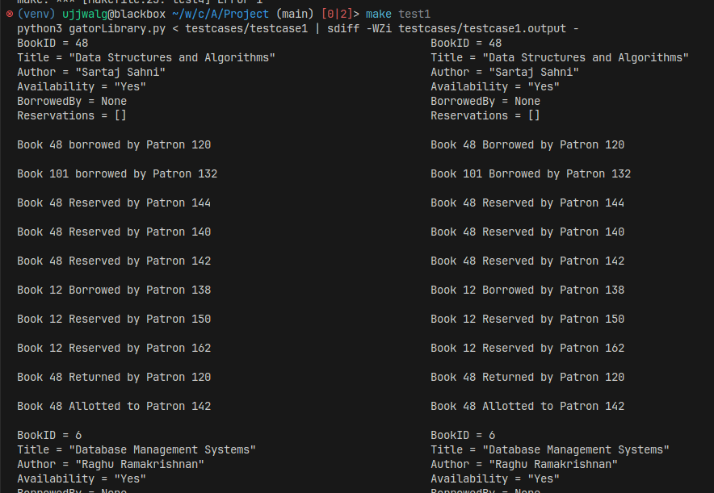

The image shows the expected output on the left and the actual output on the
right side. The output is not exactly same as the expected output at two places.

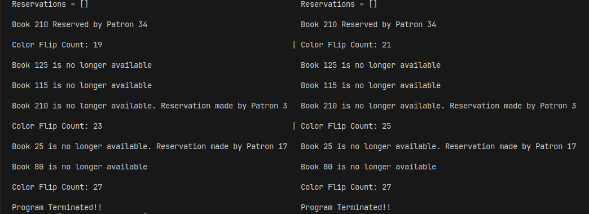

The difference is because of deletion operation. There can be multiple correct
ways of implementing the deletion operation as long as the red-black tree
properties are satisfied. Because of this, the color flip count can be
different.

Consider the dry run of the insertion and deletion operations in the red-black
tree:


| Operation | This code                        | Reference implementation          |
| --------- | -------------------------------- | --------------------------------- |
| ...       | 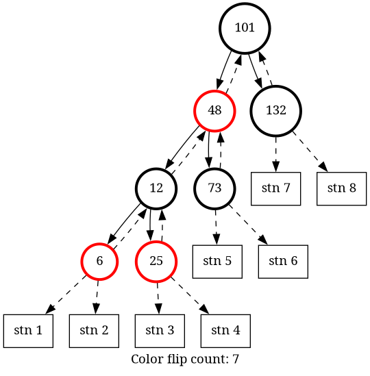 | 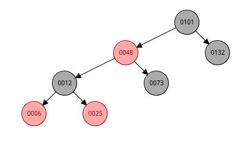 |
| Delete 12 | 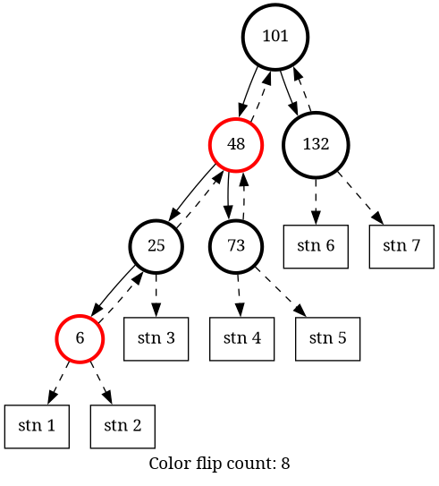  | 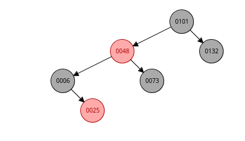  |

As we can see that `delete 12` produces a different tree in both the cases even
though both the trees are valid red-black trees. This is the reason why
color-flip count is different in both the cases. 


### Test case 2

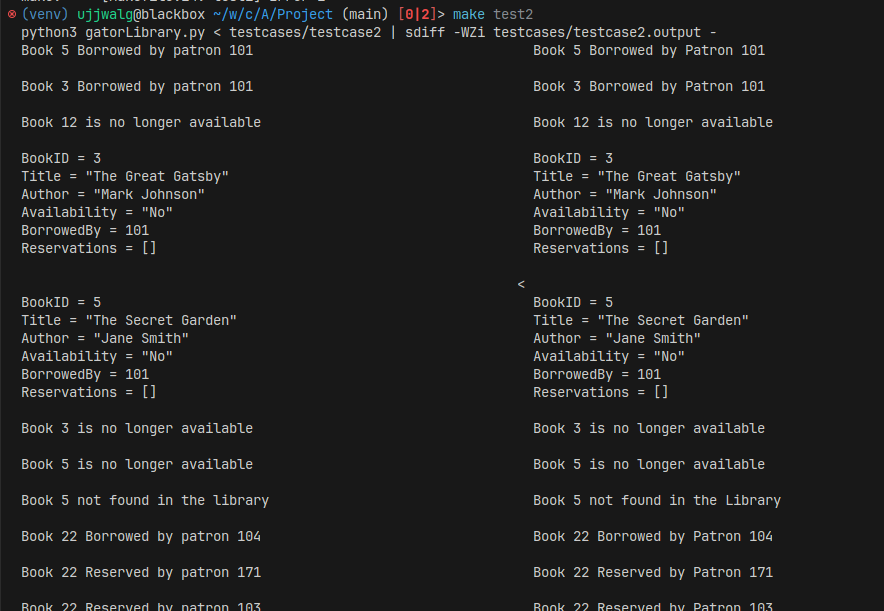

The output is same as the expected output for test case 2.

### Test case 3

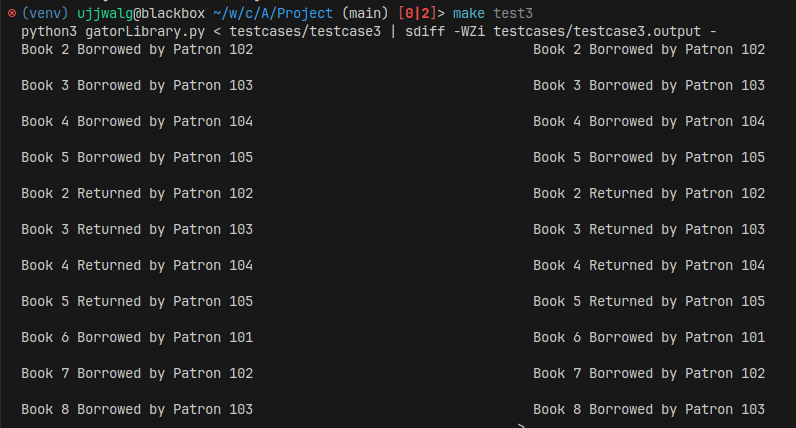

The output is same as the expected output for test case 3

### Test case 4

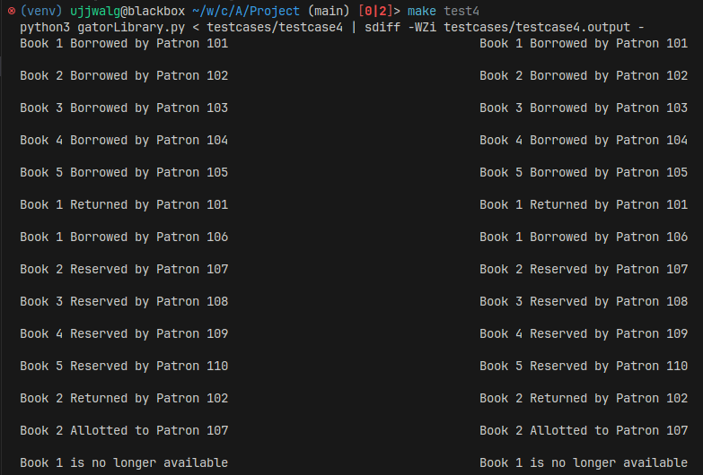

The output is same as the expected output for test case 4.


## File Structure


- `tree.py`: The red-black tree is implemented in the file `tree.py`
- `heap.py`: the binary heap is implemented in the file `heap.py`
- `gatorLibrary.py` is the main file that uses both the data structures to
  perform the operations specified in the input file. The file is responsible
  for reading the input file, creating the output. 

 `gatorLibrary.py` file depends on `tree.py` and `heap.py`.

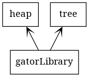

**Coupling and design**: Both, the red-black tree and the binary heap are implemented as classes and they
are independent of each other. The red-black tree is designed to store any kind
of data, while the binary heap is designed to store only a three-tuple of
integers. There is no dependency between the two data structures which keeps the
coupling to a minimum. Implementation of heap and red-black tree is completely
abstracted from the `gatorLibrary.py` file. Also, the `tree.py` has no knowledge
of `heap.py` or `gatorLibrary.py`.


## Implementation Details

Implementation for both the data structures is based on the pseudo-code provided
in Introduction to Algorithms by Cormen et al.


### Red-Black Tree

Code for the red-black tree is implemented in the file `tree.py`. Following is
the class diagram for the red-black tree generated using `pyreverse`:

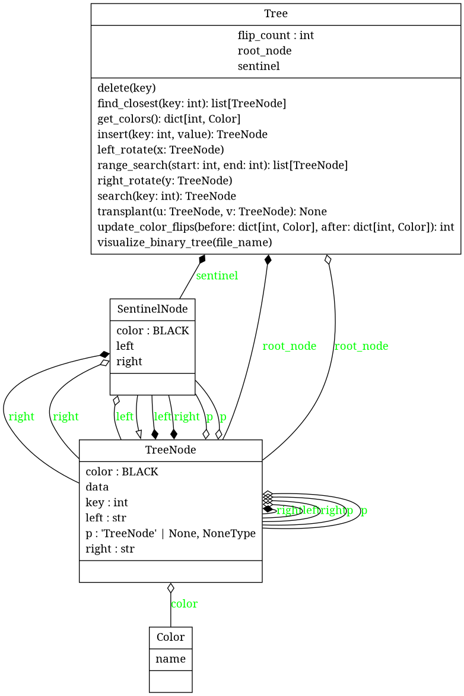

The `Tree` class is the main class that implements the red-black tree. This has
various methods like `insert`, `delete`, `search`, etc. This class holds pointer
to the root node. These are the methods in the `Tree` class:

- `left_rotate`: This method performs a left rotation on the given node. $O(1)$
  time and space complexity.
- `right_rotate`: This method performs a right rotation on the given node. $O(1)$
  time and space complexity.
- `insert`: This method inserts a new node in the tree and calls `_insert_fixup`
  if needed  to fix the tree. $O(\log n)$ time complexity.
- `_insert_fixup`: This method fixes the tree after an insertion.
- `delete`: This method deletes a node from the tree and calls `_delete_fixup` if
  needed to fix the tree. $O(\log n)$ time complexity. 
- `_delete_fixup`: This method fixes the tree after a deletion.
- `transplant`: This method replaces one subtree as a child of its parent with
  another subtree. $O(1)$ time and space complexity.
- `search`: This method searches for a node in the tree with the given key. $O(\log n)$
  time complexity.
- `find_closest`: This method finds the nodes with the closest key to the given
  key. $O(\log n)$ time complexity.
- `range_search`: This method finds all the nodes in the tree with the key in
  the given range. $O(n)$ time complexity.

The above functions are needed to implement the red-black tree as required by
the specification. But there are some other functions that are used internally,
for example, `visualize_binary_tree` is used to create a visualization of the
tree and is useful for debugging. This functions works only if `graphviz` is
installed.

The `TreeNode` class is actual class that represents a node in the red-black
tree. This class holds the data, pointers to the parent, left and right child
and the color of the node. The color is set to `BLACK` by default.

There is also a `SentinelNode` class which is used to represent the `NIL` nodes.
This class inherits from the `TreeNode` class and overrides the `__init__`
method.

#### Testing and visualizing the red-black tree

The Red-Black tree can be tested separately using the following command:

```bash
python3 tree.py
>>> insert 10
>>> insert 20
>>> insert 30
>>> insert 15
```

This will start a REPL that can be used to test the red-black tree and also
create two visualizations of the tree -- `before.png` and `after.png` . The
former shows the tree before an operation and the latter shows the tree after
the operation. The REPL also shows the color flip count.

| Before Insertion            | After Insertion            | REPL                 |
| --------------------------- | -------------------------- | -------------------- |
| 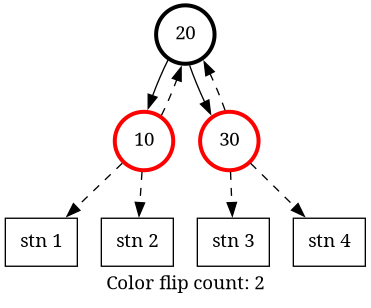 | 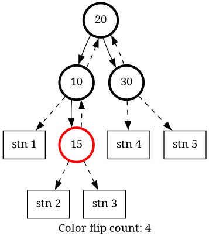 | 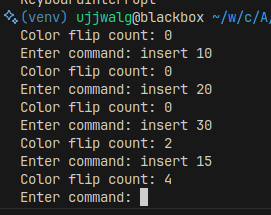 |

### Binary min-heap

Code for the binary min-heap is implemented in the file `heap.py`. Following is
the class diagram for the binary min-heap generated using `pyreverse`:

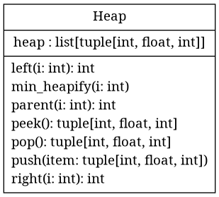

The heap is designed to store a three-tuple of integers. 

These are the methods in the `Heap` class:

- `left`: This method returns the index of the left child of the given index. $O(1)$
  time and space complexity.
- `right`: This method returns the index of the right child of the given index. $O(1)$
  time and space complexity.
- `parent`: This method returns the index of the parent of the given index. $O(1)$
  time and space complexity.
- `min_heapify`: This method maintains the min-heap property. $O(\log n)$ time
  complexity.
- `push`: This method inserts a new element in the heap. $O(\log n)$ time
  complexity.
- `pop`: This method removes the minimum element from the heap. $O(\log n)$ time
  complexity.
- `peek`: This method returns the minimum element from the heap. $O(1)$ time
  complexity.

#### Testing the min-heap

The binary min-heap can be tested separately using the following command:

```bash
python3 heap.py
>>> push 1
>>> push 2
>>> pop 2
```

### Library management system (`gatorLibrary.py`)

The library management system is implemented in the file `gatorLibrary.py`. This file uses the red-black tree and the binary min-heap to implement the library management system. Following is a list of functions in the file:

- `PrintBook`: This function prints the details of a book.
- `BorrowBook`: This function assigns a book to a patron
- `InsertBook`: This function inserts a new book in the library and initializes
  the heap for the book.
- `DeleteBook`: This function deletes a book from the library.
- `ReturnBook`: This function returns a book to the library.
- `FindClosestBook`: This function finds the book with the closest key to the
  given key using the method `find_closest` of the red-black tree.
- `Quit`: This function quits the program.
- `ColorFlipCount`: This function prints the color flip count of the red-black
  tree by assessing the `flip_count` varible of the red-black tree.
- `PrintBooks`: This function prints the details of all the books in the library
  using the `range_search` method of the red-black tree.

This file is also responsible for reading the input file, parsing it and creating the output. Since the input format is compatible with Python's syntax, `eval` function is used to parse the input file.
